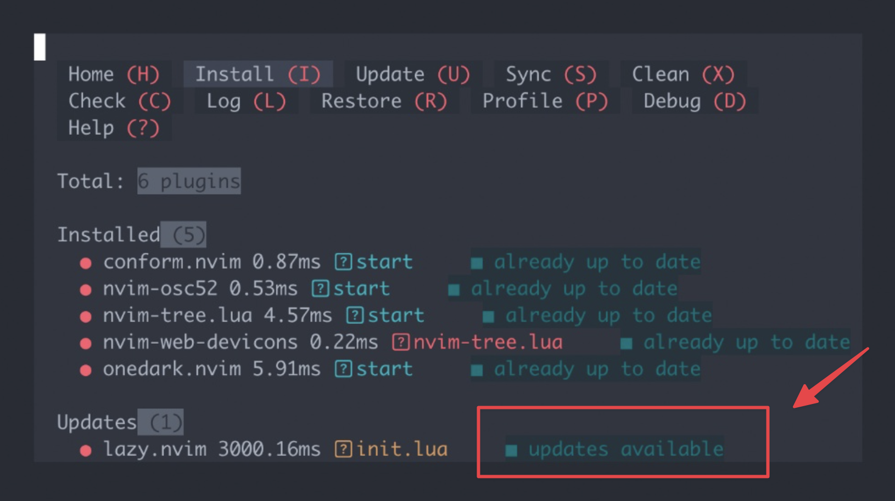

本文整理一套跨平台 Neovim 格式化全家桶安装方案，目标是在 Alpine、Debian/Ubuntu 和 macOS 下保持一致的使用体验。

这套配置包含：

- `lazy.nvim` 插件管理器
- `onedark.nvim` 护眼深色主题
- `nvim-tree.lua` 文件树
- `nvim-osc52` 远程复制
- `conform.nvim` 代码格式化
- `jq` JSON 格式化工具
- `prettier` 前端、Markdown 与 YAML 格式化工具
- `;t` 智能切换文件树
- `;f` 手动格式化
- `;w` 保存并自动格式化

## 一、安装 Neovim

要求 Neovim 版本不低于 `0.10.0`。如果系统仓库版本太旧，建议改用官方 release 或源码编译方式。

### Debian / Ubuntu

```bash
sudo apt update
sudo apt install -y neovim git curl
nvim --version | grep ^NVIM
```

如果 Debian 或 Ubuntu 仓库里的 Neovim 版本低于 `0.10.0`，可以参考源码编译方案，或使用官方 release 版本。

### Alpine

```bash
apk add --no-cache neovim git curl
nvim --version | grep ^NVIM
```

Alpine 3.23 官方仓库通常已经提供较新的 Neovim，适合直接安装。

### macOS

```bash
brew install neovim
nvim --version | grep ^NVIM
```

macOS 使用 Homebrew 安装即可，默认通常是最新稳定版。

## 二、安装格式化与剪贴板依赖

`conform.nvim` 负责调用格式化器，但真正执行格式化的是系统里的外部命令。这里建议 JSON 使用 `jq`，前端、Markdown 与 YAML 文件使用 `prettier`。

### Debian / Ubuntu

```bash
sudo apt update
sudo apt install -y nodejs npm xclip jq
sudo npm install -g prettier
```

### Alpine

```bash
apk add --no-cache nodejs npm build-base jq
npm install -g prettier
```

如果 Alpine 下 npm 下载较慢或安装失败，可以临时切换 npm 镜像源：

```bash
npm config set registry https://registry.npmmirror.com
npm install -g prettier
```

### macOS

```bash
brew install node
brew install jq
npm install -g prettier
```

安装完成后统一验证：

```bash
node -v
npm -v
jq --version
prettier -v
```

## 三、写入统一 Lua 配置

下面这份 `init.lua` 可同时用于 Alpine、Debian/Ubuntu 和 macOS。

远程 SSH 终端里不要直接粘贴超长 `cat << EOF` 脚本，容易出现粘贴错乱。先运行短命令清理并打开配置文件：

```bash
# 1. 清理旧环境
rm -rf ~/.config/nvim ~/.local/share/nvim ~/.local/state/nvim ~/.cache/nvim

# 2. 创建配置目录并打开 init.lua
mkdir -p ~/.config/nvim
nvim ~/.config/nvim/init.lua
```

进入空文件后按 `i` 进入插入模式，复制下面这段纯 `init.lua` 内容粘贴进去，然后按 `Esc`，输入 `:wq` 保存退出。

```lua
-- Basic settings
vim.g.mapleader = ";"
local opt = vim.opt
opt.number = true
opt.relativenumber = true
opt.cursorline = true
opt.termguicolors = true
opt.encoding = "utf-8"
opt.mouse = "a"
opt.timeoutlen = 800
opt.splitright = true
opt.splitbelow = true

-- Install lazy.nvim
local lazypath = vim.fn.stdpath("data") .. "/lazy/lazy.nvim"
if not (vim.uv or vim.loop).fs_stat(lazypath) then
  vim.fn.system({
    "git",
    "clone",
    "--filter=blob:none",
    "https://github.com/folke/lazy.nvim.git",
    "--branch=stable",
    lazypath,
  })
end
vim.opt.rtp:prepend(lazypath)

-- Plugins
require("lazy").setup({
  spec = {
    -- 1. Theme
    {
      "navarasu/onedark.nvim",
      lazy = false,
      priority = 1000,
      config = function()
        require("onedark").setup({ style = "dark" })
        require("onedark").load()

        local hl = vim.api.nvim_set_hl
        hl(0, "Normal", { bg = "#1e2127", fg = "#abb2bf" })
        hl(0, "NonText", { bg = "#1e2127", fg = "#3b4048" })
        hl(0, "CursorLine", { bg = "#2c313a" })
        hl(0, "Visual", { bg = "#3e4452" })
        hl(0, "Search", { bg = "#61afef", fg = "#1e2127" })
        hl(0, "IncSearch", { bg = "#98c379", fg = "#1e2127" })
      end,
    },

    -- 2. File tree
    {
      "nvim-tree/nvim-tree.lua",
      dependencies = { "nvim-tree/nvim-web-devicons" },
      config = function()
        require("nvim-tree").setup({
          view = { width = 30, side = "left" },
          renderer = { indent_markers = { enable = true } },
        })
      end,
    },

    -- 3. Remote clipboard (OSC 52)
    {
      "ojroques/nvim-osc52",
      config = function()
        require("osc52").setup()
        vim.api.nvim_create_autocmd("TextYankPost", {
          callback = function()
            if vim.v.event.operator == "y" and vim.v.event.regname == "" then
              require("osc52").copy_register("")
            end
          end,
        })
      end,
    },

    -- 4. Formatting
    {
      "stevearc/conform.nvim",
      lazy = false,
      config = function()
        require("conform").setup({
          formatters_by_ft = {
            lua = { "stylua" },
            json = { "jq" },
            yaml = { "prettier" },
            html = { "prettier" },
            css = { "prettier" },
            javascript = { "prettier" },
            typescript = { "prettier" },
            markdown = { "prettier" },
          },
          formatters = {
            jq = {
              command = "jq",
              args = { "--indent", "2", "." },
              stdin = true,
            },
          },
          format_on_save = {
            timeout_ms = 3000,
            lsp_format = "fallback",
          },
          notify_on_error = true,
        })
      end,
    },
  },
})

-- Keymaps
local map = vim.keymap.set

map("n", "<leader>w", ":w<CR>", { silent = true })
map("n", "<leader>q", ":q<CR>", { silent = true })
map("n", "<CR>", ":noh<CR><CR>", { silent = true })

-- Toggle or focus file tree: ;t
map("n", "<leader>t", function()
  local view = require("nvim-tree.view")
  if view.is_visible() then
    if vim.api.nvim_get_current_win() == view.get_winnr() then
      vim.cmd("wincmd p")
    else
      vim.cmd("NvimTreeFocus")
    end
  else
    vim.cmd("NvimTreeToggle")
  end
end, { silent = true })

-- Format manually: ;f
map({ "n", "v" }, "<leader>f", function()
  require("conform").format({
    async = false,
    timeout_ms = 3000,
    lsp_format = "fallback",
  }, function(err)
    if err then
      vim.notify("Format failed: " .. err, vim.log.levels.ERROR)
    else
      vim.notify("Format done", vim.log.levels.INFO)
    end
  end)
end, { silent = true })

-- Direct format shortcut: F3
map({ "n", "v" }, "<F3>", function()
  require("conform").format({
    async = false,
    timeout_ms = 3000,
    lsp_format = "fallback",
  }, function(err)
    if err then
      vim.notify("Format failed: " .. err, vim.log.levels.ERROR)
    else
      vim.notify("Format done", vim.log.levels.INFO)
    end
  end)
end, { silent = true })

-- Window navigation
map("n", "<C-h>", "<C-w>h")
map("n", "<C-l>", "<C-w>l")
map("n", "<C-j>", "<C-w>j")
map("n", "<C-k>", "<C-w>k")
```

## 四、首次启动 Neovim

执行：

```bash
nvim
```

启动后：



配置和插件已经全部成功加载并正常工作了。

插件安装完成：conform.nvim、nvim-osc52、nvim-tree.lua、nvim-web-devicons 和 onedark.nvim 5 个插件已全部成功安装，处于 start 运行状态。

管理器运行正常：底部的 `**lazy.nvim**` 提示有**更新**（updates available），如果你想更新它，直接在当前界面按下键盘上的 `U` 键即可。


现在可以按下 `q` 退出这个管理界面，开始正常使用你的 Neovim 了。


如果 GitHub 访问不稳定，插件下载可能失败。确认网络后，重新打开 Neovim，或者在 Neovim 内执行：

```vim
:Lazy sync
```

## 五、验证格式化功能

新建 JSON 文件：

```bash
nvim test.json
```

写入未格式化内容：

```json
{"name":"ubuntu","version":"24.04","editor":"neovim"}
```

普通模式下输入：

```vim
;f
```

如果配置正常，文件会被 `jq` 展开成多行：

```json
{
  "name": "ubuntu",
  "version": "24.04",
  "editor": "neovim"
}
```

也可以输入：

```vim
;w
```

保存时 `conform.nvim` 会自动执行格式化。

检查格式化状态（等同看日志），如果配置文件是错的，会拒绝格式化的（比如多个符号等）：

```vim
:ConformInfo
```

注意：`:ConformInfo` 只负责查看当前 buffer 可用的 formatter，不会执行格式化。看到下面这种状态，说明 `jq` 已经可用：

```text
jq ready (json) /usr/bin/jq
```

真正执行格式化需要在普通模式下按 `;f`，或者保存文件：

```vim
:w
```

如果想绕过快捷键直接测试 `jq`，也可以执行：

```vim
:lua require("conform").format({ formatters = { "jq" }, async = false, timeout_ms = 3000 })
```

退出界面：

```vim
q
```

如果 JSON 格式化没有反应，先检查 `jq` 是否可用：

```bash
which jq
jq --version
```

如果其他文件类型的格式化没有反应，再检查 `prettier`：

```bash
which prettier
prettier -v
```

## 六、常用快捷键

- `;t`：文件树与代码窗口智能切换
- `;f`：格式化当前文件或选中范围
- `F3`：格式化当前文件或选中范围
- `;w`：保存当前文件，并触发保存时格式化
- `;q`：退出当前窗口
- `Ctrl+h/j/k/l`：在窗口之间移动
- `Enter`：清除搜索高亮

## 七、平台注意事项

Alpine 通常用于轻量虚拟机或容器，系统非常精简。如果插件下载失败，优先检查 DNS、GitHub 访问和 `git` 是否已安装。

Debian / Ubuntu 如果仓库里的 Neovim 版本过旧，建议改用源码编译或官方 release 包，不要勉强使用旧版。

macOS 的剪贴板体验通常比 Linux 更自然；如果远程 SSH 复制不生效，检查终端是否支持 OSC 52。

图标能否正常显示，取决于本地终端字体是否安装 Nerd Fonts，例如 `JetBrainsMono Nerd Font`。

至此，Alpine、Debian/Ubuntu 和 macOS 下的 Neovim 配置体验就基本统一了。
